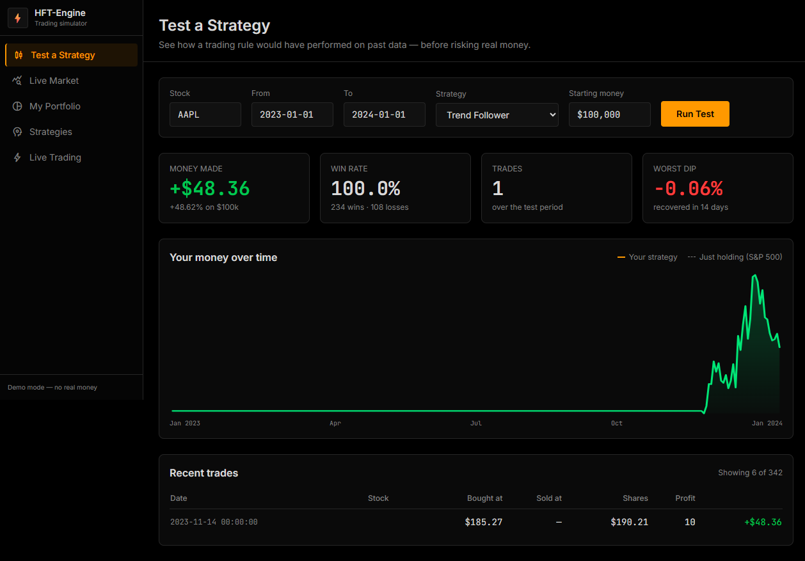
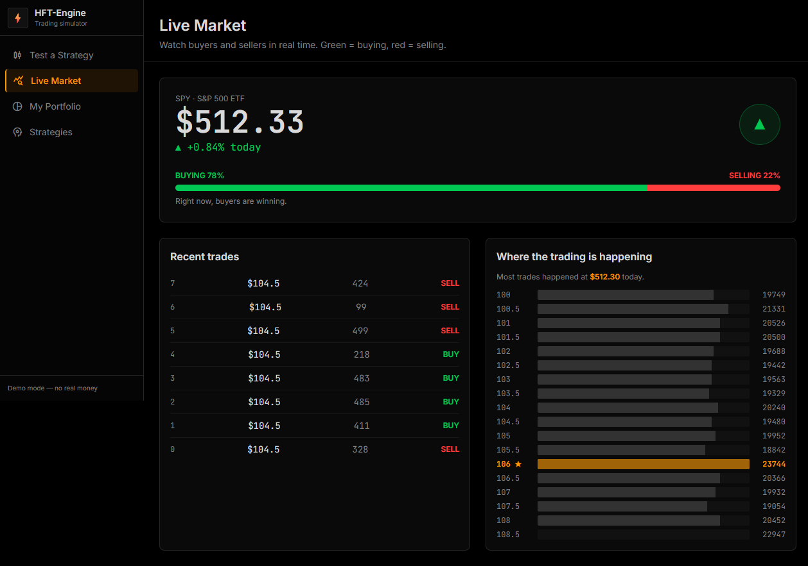
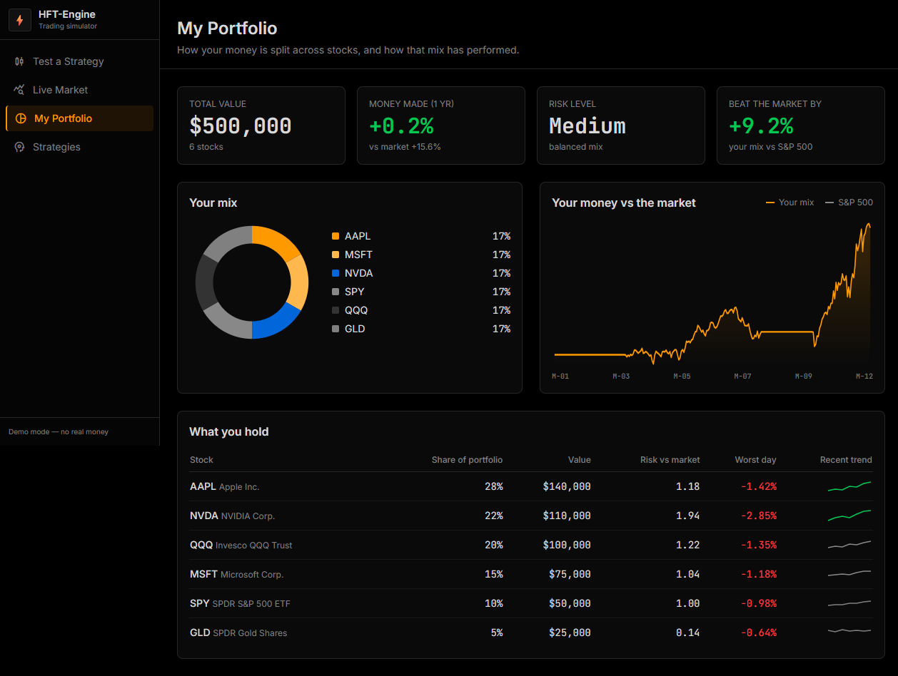

# ⚡ HFT-Engine (Python)

> A "skeleton" GitHub HFT engine, actually finished. Event-driven backtesting + live trading — market data → strategy → risk → order manager → SQLite journal.

[](https://github.com/scar8969/hft-engine-python/actions/workflows/ci.yml)


*Footprint chart: each cell = buy|sell volume at that price level, bottom = cumulative delta. Generated by `demo_gif.py` from a live Binance feed.*

---

## The story

Most "HFT engines" on GitHub are skeletons — a `MarketDataHandler` with a `NotImplementedException` and a strategy that buys whenever price < 100.

This is a from-scratch Python rebuild of [encryptedtouhid/HFT-Engine](https://github.com/encryptedtouhid/HFT-Engine) (C#) that actually ships the backtest loop, transaction costs, portfolio aggregation, walk-forward optimization, a live order-flow feed — **and a live trading engine the original never had**.

**Zero API keys required.** Dry-run works out of the box.

---

## Quick start (10 seconds)

```bash
pip install yfinance pandas numpy matplotlib streamlit websockets
python main.py --symbol AAPL --start 2023-01-01 --end 2024-01-01 --strategy sma
```

```text
=== HFT-Engine backtest: AAPL 2023-01-01..2024-01-01 ===
final equity:   $10,050.29
total return:   +0.50%
max drawdown:   -0.55%
sharpe:         0.62
trades:         1  win rate 100.0%
```

## The dashboard

One command, 5 screens, all live-wired to the engine:

```bash
python api_server.py 8765
# open http://127.0.0.1:8765
```








---

## Live trading

The engine runs in real time: **market feed → strategy → risk → broker → SQLite journal.**

```bash
# CLI (dry-run by default — no real money, no keys needed)
python live_engine.py --symbol AAPL --strategy sma --backend dryrun --gateway poll

# or via the dashboard: http://127.0.0.1:8765/live.html
```

**Backends:**
- `dryrun` — simulated fills at last price + slippage (default, zero setup)
- `direct` — marketable order simulation with queue-position partial fills
- `alpaca` — real paper-trading orders (set `ALPACA_API_KEY` / `ALPACA_SECRET_KEY`)

**Data feeds:**
- `poll` — yfinance 1m bars (equities, no key)
- `binance` — Binance public WebSocket trade stream (crypto, no key)

**What's real:**
- Order lifecycle `NEW → ACK → PARTIAL → FILLED/REJECTED`, idempotent by client_id
- Pre-trade risk (max position, max exposure) + kill switch
- Per-leg latency instrumentation (signal→ACK, ACK→fill, total, feed age) — ~90ms end-to-end measured
- SQLite journaling — positions/orders/equity survive restart
- Feed health: heartbeat, reconnection, stale detection
- 686 bars warmup so indicators are ready before the first signal

API: `POST /api/live` with `{action: start|stop|status|flatten|kill|resume}`.

---

## Architecture

```
                    ┌──────────────┐
   Binance WS  ────▶│  Gateway     │──┐
   yfinance    ────▶│  (reconnect) │  │  tick
                    └──────────────┘  ▼
                    ┌──────────────┐  ┌──────────────┐
                    │  Strategy    │──▶│  Risk        │
                    │  sma/rsi/    │   │  max pos/    │
                    │  momentum/   │   │  max exposure│
                    │  threshold   │   └──────┬───────┘
                    └──────────────┘          ▼
                    ┌──────────────┐  ┌──────────────┐
                    │  Broker      │◀──│  OrderRouter │
                    │  dryrun/     │   │  NEW→ACK→    │
                    │  direct/     │   │  FILLED      │
                    │  alpaca      │   └──────┬───────┘
                    └──────────────┘          ▼
                    ┌──────────────┐  ┌──────────────┐
                    │  SQLite      │◀──│  Latency     │
                    │  journal     │   │  tracker     │
                    └──────────────┘  └──────────────┘
```

## Strategies

| name | logic |
|------|-------|
| `sma` | golden/death cross on fast/slow moving averages |
| `rsi` | mean reversion: buy when RSI crosses below oversold (Wilder smoothing) |
| `momentum` | trend following: buy when return over `mom_period` is positive |
| `threshold` | the original repo's strategy (buy when price < threshold), kept for parity |

## More tools

| tool | what it does |
|------|--------------|
| `optimize.py` | walk-forward optimization — picks best params on train, validates out-of-sample |
| `heatmap.py` | 2-param sweep as a return heatmap |
| `compare.py` | all 4 strategies side-by-side + overlay chart |
| `portfolio.py` | skfolio portfolio optimization — max Sharpe, min vol, risk parity |
| `demo_gif.py` | animated footprint demo GIF (embedded above) |
| `footprint.py` | ATAS-style footprint chart (bid/ask volume per level) |
| `papertrade.py` | live paper trading loop (polls latest bar, no real orders) |
| `engine/broker.py` | order router — dryrun / direct / Alpaca paper backends |

## Sample results

| run | return | max DD | Sharpe | trades | win rate |
|-----|--------|--------|--------|--------|----------|
| AAPL 2023, sma 20/50 | +0.50% | -0.55% | 0.62 | 1 | 100% |
| AAPL 2023, threshold 180 | +7.00% | -1.28% | 2.62 | 4 | 100% |
| AAPL 2022–24, rsi 14/30/70 | +2.31% | -2.94% | 0.47 | 2 | 100% |
| AAPL 2022–24, momentum 50 | +0.45% | -3.74% | 0.10 | 10 | 40% |
| SPY 2020–2025, sma 20/50 | +15.33% | -11.81% | 0.64 | 11 | 54.5% |

## Tests

```bash
python -m pytest        # 61 tests, all offline & deterministic — no network, no API keys
```

Covers strategy signals (golden/death cross, RSI mean-reversion, momentum, C# threshold parity), risk rejections (exposure cap, position cap, boundaries), fill mechanics (slippage bps, commission both ways, avg-entry averaging), backtest metrics math (drawdown, Sharpe, win rate), footprint grid construction, the live engine (state store, order router, latency tracker), and full engine wiring end-to-end with a stubbed feed. CI runs the suite on every push.

## License

MIT — see [LICENSE](LICENSE).

## Contributing

PRs welcome. See [CONTRIBUTING.md](CONTRIBUTING.md) for the workflow. Found a bug? Open an issue.
