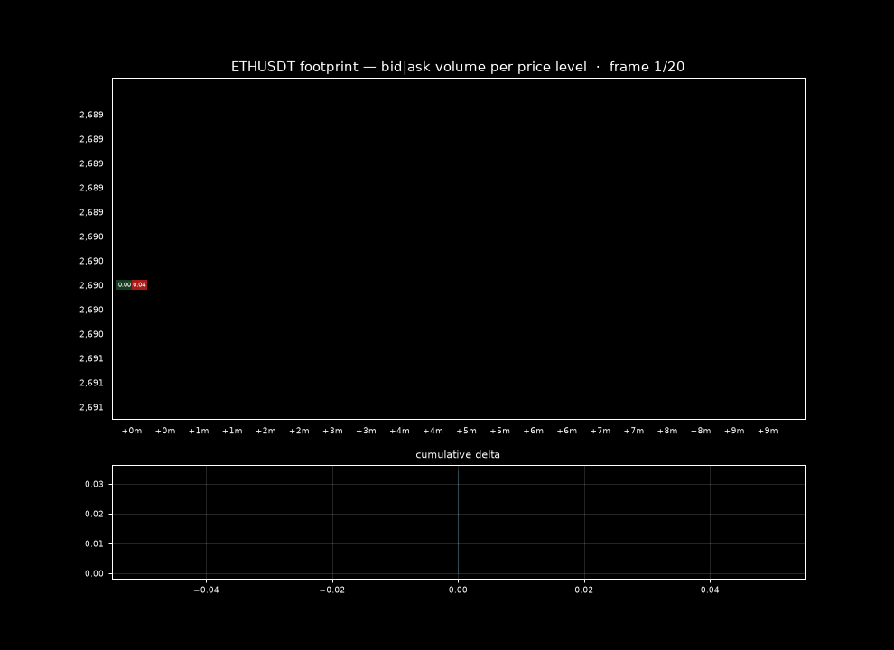

# ⚡ HFT-Engine (Python)

> Event-driven backtesting engine with real order-flow data — market data → strategy → risk → order manager. [Install in 10 seconds.](#install)



*Footprint chart: each cell = buy|sell volume at that price level, bottom = cumulative delta. Generated by `demo_gif.py` from a live Binance feed.*

  

⚡ **Try this first:**
```bash
pip install yfinance pandas numpy matplotlib streamlit websockets
python main.py --symbol AAPL --start 2023-01-01 --end 2024-01-01 --strategy sma
```

[Install](#install) · [Live order flow](#live-order-flow) · [Strategies](#strategies) · [Dashboard](#dashboard) · [Contributing](#contributing)

---

## Why this exists

Most "HFT engines" on GitHub are skeletons — a `MarketDataHandler` with a `NotImplementedException` and a strategy that buys whenever price < 100. This is a from-scratch Python rebuild of [encryptedtouhid/HFT-Engine](https://github.com/encryptedtouhid/HFT-Engine) (C#) that actually ships the backtest loop, transaction costs, portfolio aggregation, walk-forward optimization, and a live order-flow feed — all in ~1500 lines of readable Python.

## Prerequisites

- Python 3.11+
- pip

## Install

```bash
pip install yfinance pandas numpy matplotlib streamlit websockets
```

No API keys. No accounts. No database.

## Try this first

```bash
python main.py --symbol AAPL --start 2023-01-01 --end 2024-01-01 --strategy sma
```

Expected output:

```
=== HFT-Engine backtest: AAPL 2023-01-01..2024-01-01 ===
strategy: sma (fast=20 slow=50)
bars: 250  rejected orders: 0
----------------------------------------------
final equity:   $10,050.29
total return:   +0.50%
max drawdown:   -0.55%
sharpe:         0.62
trades:         1  win rate 100.0%
```

## Live order flow

ATAS-style footprint data (delta, buy/sell volume, depth) straight from Binance — no API key:

```bash
python livefeed.py --symbol BTCUSDT --bars 10
```

```
[22:38:15] btcusdt px=84074.99 Δ=-0.1 vol=0.3 (B 0.1/S 0.2) trades=56 spread=0.01  bid=84074.98 ask=84074.99
```

## Strategies

| name | logic |
|------|-------|
| `sma` | golden/death cross on fast/slow moving averages |
| `rsi` | mean reversion: buy when RSI crosses below oversold (Wilder smoothing) |
| `momentum` | trend following: buy when return over `mom_period` is positive |
| `threshold` | the original repo's strategy (buy when price < threshold), kept for parity |

## Dashboard

```bash
streamlit run dashboard.py
```

Interactive backtesting with per-symbol metrics, equity curves, and trade tables.

## More tools

| tool | what it does |
|------|--------------|
| `optimize.py` | walk-forward optimization — picks best params on train, validates out-of-sample |
| `heatmap.py` | 2-param sweep as a return heatmap |
| `compare.py` | all 4 strategies side-by-side + overlay chart |
| `portfolio.py` | skfolio portfolio optimization — max Sharpe, min vol, risk parity |
| `demo_gif.py` | animated footprint demo GIF (embedded above) |
| `footprint.py` | ATAS-style footprint chart (bid/ask volume per level) |
| `papertrade.py` | live paper trading loop (polls latest bar, no real orders) |
| `alpaca_bridge.py` | live bridge to Alpaca's free paper account |

## Sample results

| run | return | max DD | Sharpe | trades | win rate |
|-----|--------|--------|--------|--------|----------|
| AAPL 2023, sma 20/50 | +0.50% | -0.55% | 0.62 | 1 | 100% |
| AAPL 2023, threshold 180 | +7.00% | -1.28% | 2.62 | 4 | 100% |
| AAPL 2022–24, rsi 14/30/70 | +2.31% | -2.94% | 0.47 | 2 | 100% |
| AAPL 2022–24, momentum 50 | +0.45% | -3.74% | 0.10 | 10 | 40% |
| SPY 2020–2025, sma 20/50 | +15.33% | -11.81% | 0.64 | 11 | 54.5% |

## Tests

```bash
python -m pytest        # 49 tests, all offline & deterministic — no network, no API keys
```

Covers strategy signals (golden/death cross, RSI mean-reversion, momentum, C# threshold parity), risk rejections (exposure cap, position cap, boundaries), fill mechanics (slippage bps, commission both ways, avg-entry averaging), backtest metrics math (drawdown, Sharpe, win rate), footprint grid construction, and full engine wiring end-to-end with a stubbed feed. CI runs the suite on every push.

## License

MIT — see [LICENSE](LICENSE).

## Contributing

PRs welcome. See [CONTRIBUTING.md](CONTRIBUTING.md) for the workflow. Found a bug? Open an issue.
